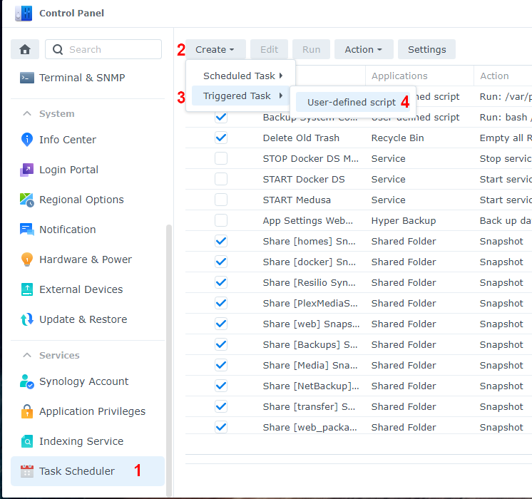
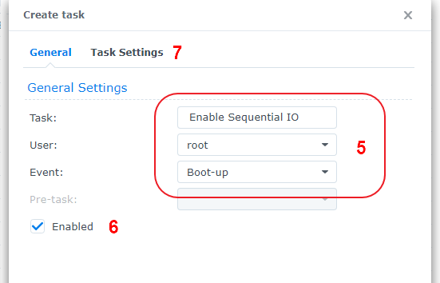
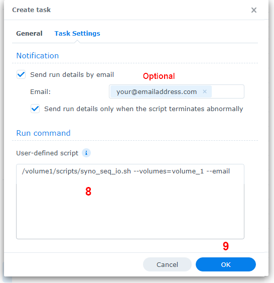

# How to schedule a script in Synology Task Scheduler

To schedule a script to run on your Synology at boot-up follow these steps:

1. Go to **Control Panel** > **Task Scheduler** > click **Create** > and select **Triggered Task**.
2. Select **User-defined script**.
3. Enter a task name.
4. Select **root** as the user (The script needs to run as root).
5. Select **Boot-up** as the event that triggers the task.
6. Leave **Enable** ticked.
7. Click **Task Settings**.
8. Optionally you can tick **Send run details by email** and **Send run details only when the script terminates abnormally** then enter your email address.
9. In the box under **User-defined script** type the path to the script. 
    - e.g. If you saved the script to a shared folder on volume1 called "scripts" and your cache was set to volume1 you'd type:
    - **/volume1/scripts/syno_enable_sequential_IO.sh --email --volumes=volume_1**
    - or if you have caches was set to volume1 and volume2 you'd type:
    - **/volume1/scripts/syno_enable_sequential_IO.sh --email --volumes=volume_1,volumes_2**
    - For information on the options see [Options](README.md#options)
11. Click **OK** to save the settings.

Here's some screenshots showing what needs to be set:

